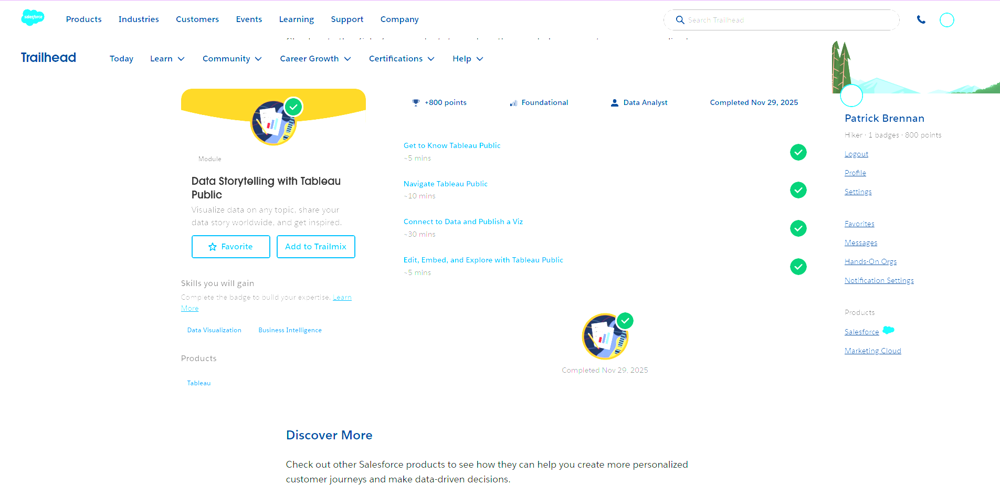
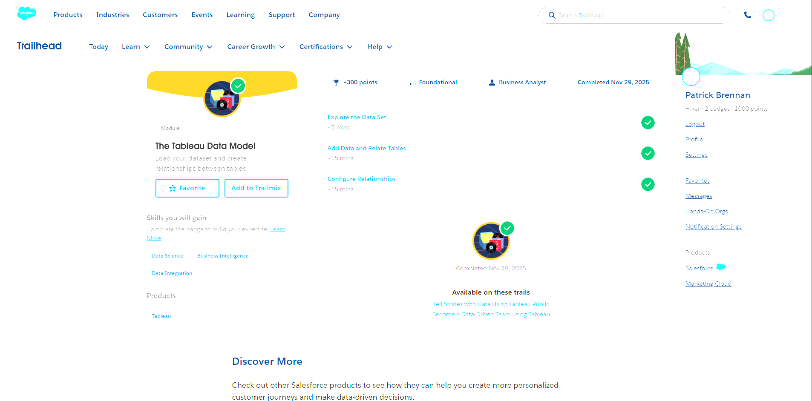
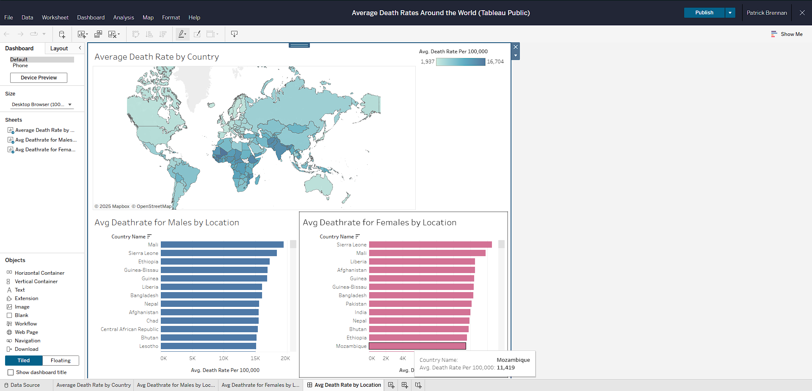

# tableau_trailhead_basics

## Badges

## My Dashboard
https://public.tableau.com/views/AverageDeathRatesAroundtheWorld/AvgDeathRatebyLocation?:language=en-US&:sid=&:redirect=auth&:display_count=n&:origin=viz_share_link

## Reflection
One important principle I took away from the storytelling module is to make sure there is a conclusion to be made from your data. For my visualization, I made sure this factor was included, the conclusion I made from my visual being the disparity in death rate between third-world and first-world countries. Meanwhile, one key concept from the data model module was the working with multiple tables, which often comes with relationships between two or more. This is significant when working with real-world data as often data is better organized into seperate files, but to tell the story these can be combined using a common value such as an ID (or in the case of the Great British Bake-Off, an episode). A Healthcare scenario which may benefit from using Tableau would be track LOS across a hospital/health system. This would allow the creation of simple bar graphs to show the locations or diagnosis codes with the longest LOS, a line graph to show how average LOS may change over time, or even multiple in a single graph, all in one place.
